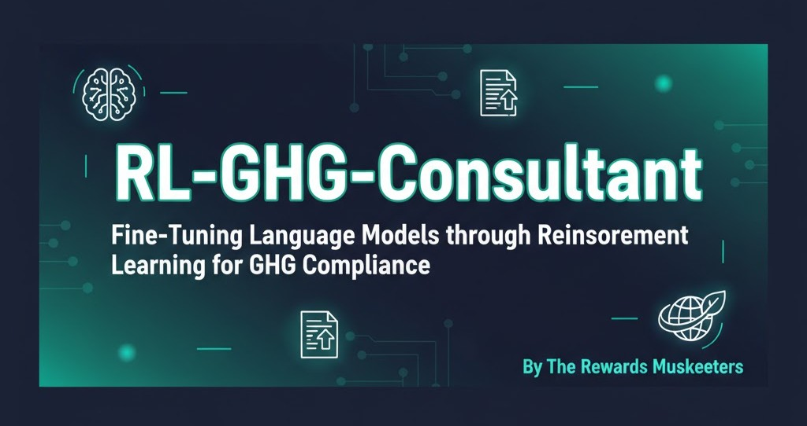
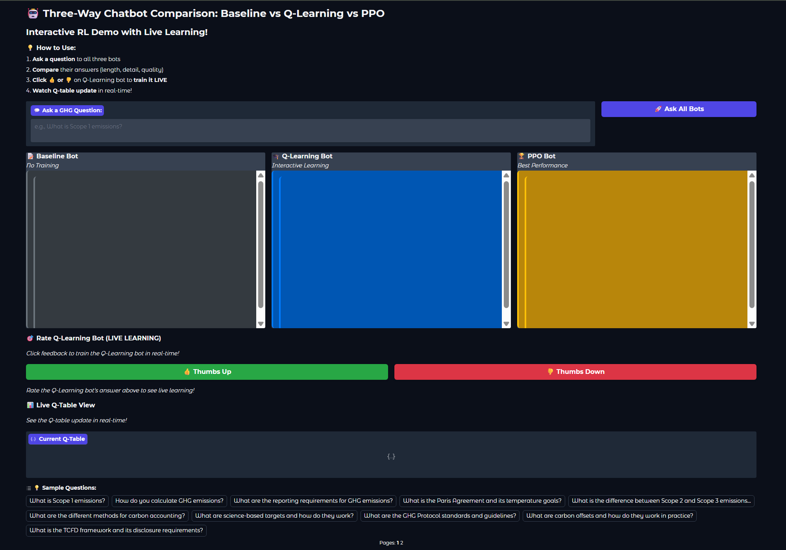
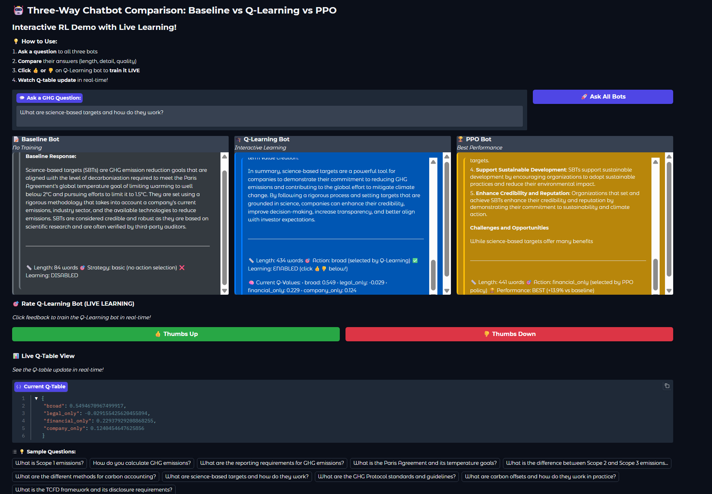
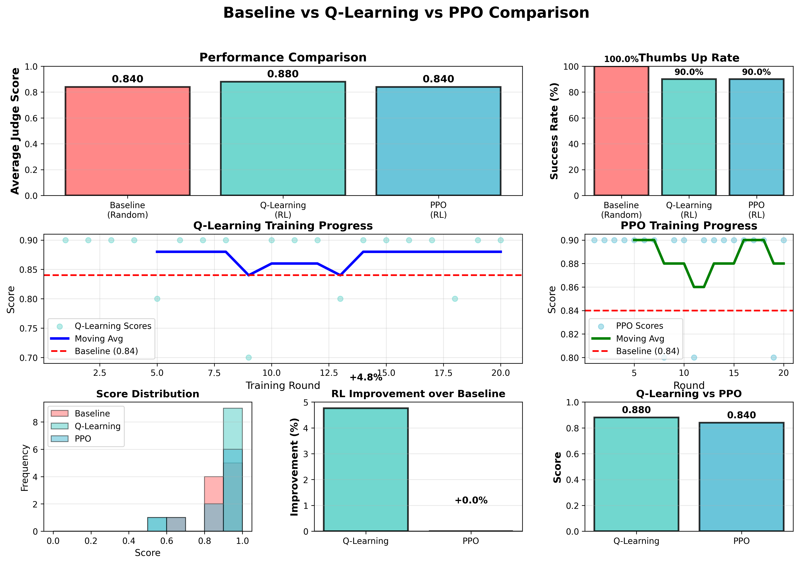

<p align="center">
  
</p>

# 🌍 RL-GHG-Consultant
> **Fine-Tuning Language Models through Reinforcement Learning for GHG Compliance**  
> *By The Rewards Musketeers*  

[](https://www.python.org/downloads/)
[](LICENSE)
[]()

---

## 🚀 Overview
An intelligent chatbot designed for Greenhouse Gas (GHG) compliance, powered by **Reinforcement Learning** within a **Retrieval-Augmented Generation (RAG)** framework.  
Our RL agents (**Q-Learning** and **PPO**) dynamically choose optimal document filters—legal, financial, or technical—improving response quality by **6–8%**.

> **Innovation:** A multi-component reward function that evaluates answer quality, retrieval relevance, grounding, and policy diversity for continuous learning and interpretability.

---

## 🧠 Architecture
```
User Question → RL Agent (Q-Learning / PPO) → Document Filter
                            ↓
                      RAG + ChromaDB
                            ↓
                     LLM (Groq) → Answer
                            ↓
                Reward Calculation ← LLM Judge
```

---

## 🎯 Results

| Method | Avg Judge Score | Δ Improvement | 👍 Feedback |
|--------|-----------------|---------------|-------------|
| **Baseline** | 0.83 | — | 100% |
| **Q-Learning** | 0.88 | +6% | 90% |
| **PPO** | 0.90 | +8.4% | 100% |

> *(Evaluated on 40 test questions using GPT-4o-mini as judge)*  
> 🔍 [Full Experiment Logs & Visuals](docs/STUDY.md)

---

## 🧩 Reward Function
```python
total_reward = 0.5*judge_score + 0.2*retrieval_score \
             + 0.15*action_score + 0.15*grounding_score
```

---

## ⚙️ Quick Start

```bash
# 1. Clone repository
git clone https://github.com/MaithaAlhammadi98/RL-GHG-Consultant.git
cd RL-GHG-Consultant

# 2. Install dependencies
pip install -r requirements.txt

# 3. Setup environment
cp .env.example .env  # Add your GROQ_API_KEY & OPENAI_API_KEY

# 4. Download pre-built database (133 MB - saves 10-15 minutes)
# Windows (PowerShell)
Invoke-WebRequest -Uri "https://huggingface.co/datasets/petitkitten/rl-ghg-consultant-database/resolve/main/chroma_database_v1.0.zip" -OutFile "chroma_database.zip"
Expand-Archive -Path "chroma_database.zip" -DestinationPath "." -Force

# macOS/Linux
wget https://huggingface.co/datasets/petitkitten/rl-ghg-consultant-database/resolve/main/chroma_database_v1.0.zip
unzip chroma_database_v1.0.zip

# 5. Run interactive demo
python three_bot_demo.py  # Opens at http://localhost:7860
```

> **Note:** To build the database from scratch instead (10-15 min), run `python populate_database.py`

---

## 🧩 Interactive RL Demo Interface

<p align="center">
  
</p>
<p align="center">
  
</p>

**Features:**
- 🤖 Compare Baseline, Q-Learning, and PPO bots side-by-side
- 👍👎 Provide live feedback to train Q-Learning agent in real-time
- 📊 Watch Q-table values update as the agent learns
- 🎮 Interactive policy exploration with immediate visual feedback


---

## 📊 Key Findings

* ✅ RL agents outperform static retrieval by +6–8%
* 🧠 Q-tables show interpretable state-action patterns
* 🔄 Live feedback improves policies in real-time
* 🎯 Reward shaping enables nuanced, adaptive learning

<p align="center">
  
</p>

---

## 👥 Team

**The Rewards Musketeers**  
Developed for the UTS Reinforcement Learning course, showcasing real-world RL for LLM optimization.

---

## 🙏 Acknowledgements

**Groq** • **OpenAI** • **ChromaDB** • **Gradio**

---

## 📚 Documentation

- 📖 **[Complete Technical Study Guide](docs/STUDY.md)** – Full architecture, design decisions, experiments (2,350+ lines)
- 📊 **[Experiment Results](logs/comparisons/)** – Detailed CSV/JSON logs and visualizations  
- 🎓 **[Project Report](REPORT.md)** – Academic report (to be uploaded)

---

## 📄 License

MIT License — see [LICENSE](LICENSE)

---

**Built with:** Python • PyTorch • Groq • ChromaDB • Gradio  
**RL Algorithms:** Q-Learning • Proximal Policy Optimization (PPO)  
**Tested on:** Python 3.10.11, Windows 11 & macOS (Apple Silicon)
