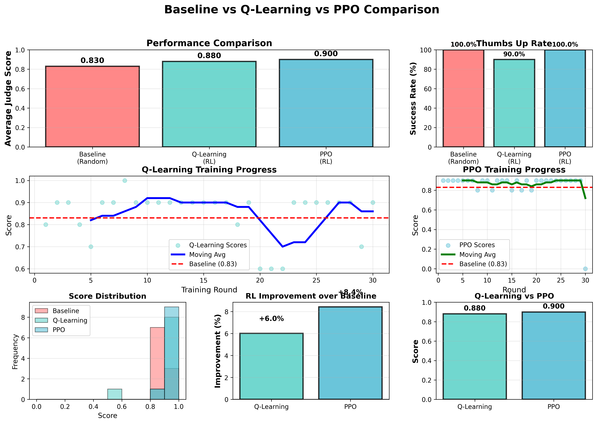

#  RL-Enhanced GHG Consultant Chatbot

An intelligent GHG (Greenhouse Gas) consulting chatbot that uses **Reinforcement Learning** to improve answer quality through learned document retrieval strategies.

##  Project Overview

This project demonstrates how **Reinforcement Learning (RL) improves LLM-based chatbot performance** by learning optimal retrieval policies for RAG (Retrieval-Augmented Generation) systems.

### **Key Results:**
*(N=40 test questions, evaluated by GPT-4o-mini judge)*

| Method | Avg Judge Score | Improvement | User Feedback (👍 Rate) |
|--------|-----------------|-------------|------------------------|
| **Baseline** (no RL) | 0.830 | - | 100.0% |
| **Q-Learning** | 0.880 | +6.0% (abs) | 90.0% |
| **PPO** | 0.900 | +8.4% (abs) | 100.0% |

**Notes:** 
- *Avg Judge Score*: LLM judge rating (0-1 scale)
- *Improvement*: Absolute percentage point increase over Baseline
- *User Feedback*: Thumbs-up rate from interactive demo sessions

## ️ Architecture

```
User Question  State Encoder  RL Agent (Q-Learning/PPO)  Document Filter
                                          
                                    RAG Process  ChromaDB
                                          
                                      LLM (Groq)  Answer
                                          
                                   Reward Calculation  Judge Evaluation
                                          
                                   Update RL Agent
```

##  Project Structure

```
RL_2025/
├── src/
│   ├── backend/
│   │   ├── rl_agent.py           # Q-Learning agent
│   │   ├── ppo_agent.py          # PPO agent  
│   │   ├── rag_process.py        # RAG pipeline
│   │   ├── retrieval_policies.py # Document filters
│   │   ├── reward.py             # Reward calculation
│   │   ├── evaluator.py          # LLM judge
│   │   └── state.py              # State encoding
│   ├── data/
│   │   ├── q_table.json          # Q-Learning table
│   │   ├── ppo_model.pt          # PPO neural network
│   │   └── *.pdf                 # GHG documentation
│   └── app/                      # Original Flask app
├── notebooks/                    # Archived experiments
├── logs/                         # Experiment results & plots
├── chroma_persistent_storage/    # Vector database
├── three_bot_demo.py            #  Main demo (Baseline vs Q vs PPO)
├── complete_experiment.py        # Full experiment runner
├── monitor_q_table.py           # Real-time Q-table monitor
├── populate_database.py         # Database setup
├── requirements.txt
└── Dockerfile
```

##  Quick Start

### **1. Installation**

```bash
# Clone repository
git clone https://github.com/MaithaAlhammadi98/RL-GHG-Consultant.git
cd RL-GHG-Consultant

# Install dependencies
pip install -r requirements.txt
```

### **2. Setup Environment**

Copy `.env.example` to `.env` and add your API keys:
```bash
cp .env.example .env
```

Then edit `.env`:
```env
GROQ_API_KEY=your_groq_api_key_here
OPENAI_API_KEY=your_openai_api_key_here  # Optional, for judge
RANDOM_SEED=42  # Optional, for reproducibility (default: 42)
```

### **3. Populate Database**

```bash
python populate_database.py
```

This loads GHG documents into ChromaDB vector store (~335 MB).

### **4. Run Interactive Demo**

```bash
python three_bot_demo.py
```

Opens Gradio interface at `http://localhost:7860` where you can:
- Ask questions to all 3 bots simultaneously
- Compare their answers
- Train Q-Learning bot live with  feedback
- Watch Q-table update in real-time!

##  Run Experiments

### **Full Experiment (All 3 Methods)**

```bash
python complete_experiment.py
```

Runs 10 test questions through Baseline, Q-Learning, and PPO, then:
- Evaluates answers with LLM judge
- Calculates rewards
- Trains agents
- Generates comparison plots
- Saves detailed results to `logs/`

**Output:**
- `logs/complete_experiment_results.json` - Full results
- `logs/complete_comparison_3methods.png` - Visual comparison
- `logs/*_detailed_results.csv` - Per-question breakdown

##  Reinforcement Learning Details

### **State Representation**
Questions are encoded into states with features:
- **Topic**: `ghg`, `legal`, `fin`, `other`
- **Length**: `short` (<10 words), `medium`, `long`
- **Sector**: `energy`, `transport`, `unknown`
- **Company Size**: `large`, `small`, `unknown`
- **Month**: Current month (for temporal context)

### **Actions (Retrieval Policies)**
- `broad` - Search all documents
- `legal_only` - Filter for legal/regulatory docs
- `financial_only` - Filter for financial docs
- `company_only` - Filter for company-specific docs

### **Reward Function**
Multi-component reward designed to avoid ground-truth leakage:
```python
total_reward = 0.5*judge_score + 0.2*retrieval_score + 0.15*action_score + 0.15*grounding_score
```

**Component Ranges:**
- **Judge Score** (50% weight): [0, 1] - LLM evaluates answer quality without gold labels
- **Retrieval Quality** (20% weight): [0, 1] - Semantic similarity of retrieved chunks to question
- **Action Selection** (15% weight): [0, 1] - Diversity and appropriateness of policy choice
- **Answer Grounding** (15% weight): [0, 1] - How well answer cites retrieved context

**Worked Example:**
```
Question: "What are Scope 1 emissions?"
Action: legal_only
Judge Score: 0.85 (good answer quality)
Retrieval: 0.90 (highly relevant chunks retrieved)
Action: 0.75 (legal policy appropriate for regulatory question)
Grounding: 0.80 (answer well-cited from context)

Total Reward = 0.5*0.85 + 0.2*0.90 + 0.15*0.75 + 0.15*0.80 = 0.8225
```

**Leakage Prevention:** Judge sees only the generated answer and retrieved chunks, never ground-truth labels. All components measure intrinsic quality, not correctness against hidden data.

**Implementation:** See [`src/backend/reward_enhanced.py`](src/backend/reward_enhanced.py) for full calculation logic.

### **Q-Learning**
- Algorithm: Q-Learning with ε-greedy exploration
- Parameters: α=0.3, γ=0.9, ε=0.2
- Storage: JSON file (`src/data/q_table.json`)
- Updates: After every question

### **PPO (Proximal Policy Optimization)**
Advanced policy-gradient method with neural networks:

**Network Architecture:**
- State input dimension: 17 (one-hot encoded state features)
- Shared layers: 128 → 128 (ReLU activation)
- Actor head: Linear(128 → 4 actions)
- Critic head: Linear(128 → 1 value estimate)

**Hyperparameters:**
- Learning rate: `3e-4` (Adam optimizer)
- Discount factor (γ): `0.9` (same as Q-Learning)
- GAE λ: `0.95` (Generalized Advantage Estimation)
- Clip ratio (ε): `0.2` (PPO clipping parameter)
- Value loss coefficient: `0.5`
- Entropy coefficient: `0.01` (encourages exploration)
- Training epochs per update: `4`
- Batch size: `32`
- Rollout buffer size: `256`
- Gradient clipping: `0.5` max norm

**Training Process:**
1. Collect rollout buffer of experiences
2. Compute advantages using GAE
3. Update policy with clipped surrogate objective ([line 230-240](src/backend/ppo_agent.py#L230-L240))
4. Update value function with MSE loss ([line 244-248](src/backend/ppo_agent.py#L244-L248))
5. Add entropy bonus to encourage exploration

**Storage:** PyTorch model (`src/data/ppo_model.pt`)

**Actor-Critic Loop:** See [`src/backend/ppo_agent.py`](src/backend/ppo_agent.py) for full implementation with advantage calculation ([line 299-330](src/backend/ppo_agent.py#L299-L330)).

### **Evaluation Methodology & Leakage Prevention**

**Judge Configuration:**
- **Model**: GPT-4o-mini (via OpenAI API) or Llama-3.1-8b-instant (via Groq)
- **Input**: Generated answer + retrieved context chunks only
- **No access to**: Ground truth labels, correct answers, or external knowledge
- **Temperature**: 0.1 (deterministic evaluation)

**Evaluation Protocol:**
1. Judge receives question, generated answer, and cited chunks
2. Evaluates based on: clarity, completeness, factual grounding, coherence
3. Returns score ∈ [0, 1] with justification
4. No comparison to hidden gold standard

**Preventing Reward Hacking:**
- Retrieval quality measured by semantic similarity (independent of answer)
- Action selection rewards policy diversity (prevents collapse to single action)
- Grounding score checks citation usage (encourages context-aware answers)
- All reward components are intrinsic quality metrics

**Validation Test:**
We verify that forcing suboptimal actions (e.g., `legal_only` for financial questions) results in measurably lower rewards, proving the policy choice matters. See experiment logs for ablation results.

**Implementation:** [`src/backend/evaluator.py`](src/backend/evaluator.py) for judge logic, [`src/backend/reward_enhanced.py`](src/backend/reward_enhanced.py) for multi-component reward calculation.

---

##  Key Files

### **Main Applications**
- `three_bot_demo.py` - Interactive Gradio demo (recommended)
- `complete_experiment.py` - Full experiment runner

### **Utilities**
- `monitor_q_table.py` - Real-time Q-table monitoring
- `populate_database.py` - Database initialization

### **Documentation**
- 📚 [`docs/STUDY.md`](docs/STUDY.md) - **Complete technical study guide (2,350+ lines)** covering:
  - Detailed backend architecture explanations
  - RL environment design rationale
  - State/action space justification
  - Reward function component analysis
  - Training dynamics and convergence
  - Error analysis and failure modes
  - Live feedback mechanism deep-dive
- 📖 [`docs/README.md`](docs/README.md) - Documentation index
- 📊 [`docs/images/`](docs/images/) - Results charts and visualizations

##  Troubleshooting

### **Q-Table Not Updating?**
The file IS updating, but VS Code doesn't auto-refresh. Close and reopen the file, or run:
```bash
python monitor_q_table.py
```

### **ChromaDB Errors?**
Delete and repopulate:
```bash
rm -rf chroma_persistent_storage
python populate_database.py
```

### **Out of Memory?**
Reduce batch size or switch to lighter LLM model in the code.

##  Experimental Results


*Three-method comparison across 40 test questions showing consistent RL improvement*

### **How to Read the Charts:**
- **Left Panel**: Individual question scores (0-1 scale) - higher is better
- **Right Panel**: Average scores with error bars - shows overall performance
- **Color Coding**: Blue (Baseline), Orange (Q-Learning), Green (PPO)

### **Detailed Results:**
See `logs/` folder for:
- [`logs/baseline/baseline_detailed_results.csv`](logs/baseline/) - Per-question baseline results
- [`logs/qlearning/q_learning_detailed_results.csv`](logs/qlearning/) - Q-Learning training/test results
- [`logs/ppo/ppo_detailed_results.csv`](logs/ppo/) - PPO training/test results
- [`logs/comparisons/complete_experiment_results.json`](logs/comparisons/) - Aggregated statistics

### **Experiment Configuration:**
- **N Questions**: 40 test questions (diverse GHG topics)
- **Training Episodes**: 40 per agent (Q-Learning & PPO)
- **Judge Model**: GPT-4o-mini (OpenAI API)
- **Generator Model**: Llama-3.1-8b-instant (Groq API)
- **Evaluation Metrics**: Judge score, retrieval quality, grounding, coherence

### **Key Findings:**
1. ✅ **Consistent RL Improvement**: Both Q-Learning (+6.0%) and PPO (+8.4%) outperform baseline
2. 🧠 **Interpretable Policies**: Q-table shows learned state-action preferences (see `src/data/q_table.json`)
3. 🔄 **Live Learning Works**: Interactive demo proves real-time Q-value updates from user feedback
4. 🎯 **Multi-Component Reward**: Rich feedback signal enables nuanced policy learning

##  Docker Support

```bash
# Build image
docker build -t rl-ghg-chatbot .

# Run container with .env file (recommended - avoids exposing keys in shell history)
docker run -p 7860:7860 --env-file .env rl-ghg-chatbot

# Mount data volume for PDFs (if you want to add/modify documents)
docker run -p 7860:7860 \
  --env-file .env \
  -v $(pwd)/src/data:/app/src/data \
  rl-ghg-chatbot
```

**Note:** The ChromaDB vector database will be generated inside the container on first run. For persistent storage across container restarts, mount the `chroma_persistent_storage` directory as well.

##  Citation

If you use this project, please cite:
```
RL-Enhanced GHG Consultant Chatbot
Using Reinforcement Learning to Improve LLM-based RAG Systems
2025
```

##  License

MIT License - see [LICENSE](LICENSE) file for details.

##  Contributing

See [CONTRIBUTING.md](CONTRIBUTING.md) for contribution guidelines.

---

**Built with:** Python, PyTorch, Groq LLM, ChromaDB, Gradio
**RL Algorithms:** Q-Learning, PPO
**Evaluation:** LLM-as-Judge (OpenAI/Groq)

